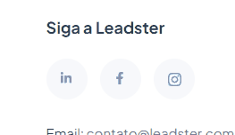

<h1 align="center">
  <p align="center">Leadster</p>
  <a href="https://leadster.com.br">
    
  </a>
</h1>
<h2 align="center" style="padding-bottom: 10px;">Este é um teste para a vaga de desenvolvedor Front-end para a [Leadster](https://leadster.com.br)</h2>
<p align="center">

  <a href="https://nextjs.org">
    
  </a>
  <a href="https://tailwindcss.com">
    
  </a>
  <a href="https://nodejs.org/en">
    
  </a>
  <a href="https://www.npmjs.com">
    
  </a>
  
  <a href="https://github.com/facebook/jest"></a>
  <a href="https://vercel.com/new/clone?repository-url=https%3A%2F%2Fgithub.com%2Ffacebook%2Fdocusaurus%2Ftree%2Fmain%2Fexamples%2Fclassic&project-name=my-docusaurus-site&repo-name=my-docusaurus-site"></a>
  
</p>
<p align="center" style="padding-top: 15px;">O projeto...<p>
<p align="center">
  <a href="#sobre">Sobre</a> · 
  <a href="#tecnologias">Tecnologias</a> · 
  <a href="#pre-requisitos">Pré-requisitos</a> · 
  <a href="#install">Instalação</a> · 
  <a href="#autor">Autor</a>
<p>
<hr />
<h3 id="sobre">Sobre</h3>
<p>Este projeto foi desenvolvido em Next.js, e usa um arquivo json para listar os vídeos que são exibidos na modal.</p> 
<p>Este arquivo json tem algumas configurações básicas para o bom funcionamento do projeto, como:</p>
<ul>
<li>Title: Título do vídeo</li>
<li>url: Apenas o parâmetro 'v' da URL do youtube - por exemplo: 'ouCGdcnxeu8'</li>
<li>publicacao: Data de publicação (usado no filtro de ordenação). Formato Date: YYYY-MM-DD</li>
<li>duration: Duração do vídeo (também utilizado no filtro de ordenação). Formato de segundos</li>
<li>description: Descrição do vídeo. Formato de texto sem limite de caracteres</li>
<li>thumb: Endereço da imagem que será carregada na LP</li>
<li>files: Endereço dos arquivos (spreadsheet, document, presentation e zipfile) para download de cada vídeo. Permitido apenas um tipo por vídeo</li>
</ul>
<p>Todos os arquivos e imagens devem estar na pasta '/public/videos'. As imagens na pasta 'thumb' e os arquivos na pasta 'files'.</p>
<p>Tempo de desenvolvimento: do dia 09/07/2023 à 15/07/2023<p>

<h4>Algumas observações sobre o teste:</h4>
<dl>
  <dt style="padding-bottom: 10px;">- Desenvolvi a LP com tailwind. Sei que o pedido era com uso de Styled components, mas quis mostrar a minha experiência com o uso de Tailwind</dt>
  <dt>- Fiz dois acréscimos ao layout que não foram propostos</dt>
  <dd style="padding-bottom: 10px;">1. Adicionei um botão de toggle pra darkmode</dd>
  <dd></dd>

  <dt style="padding: 20px 0 10px;">2. Nos botões das redes sociais que se encontram no footer, eu coloquei no hover as cores originais de cada rede, ou quase isso.</dt>

  <dd></dd>
</dl>
<p></p>
<h3 id="tecnologias">Tecnologias</h3>
<div style="text-align: center">
  <div style="float: left; padding-right: 15px; text-align: center">
    <a href="https://www.w3schools.com/css/" target="_blank" rel="noreferrer"> <br />CSS</a>
  </div>
  <div style="float: left; padding-right: 15px; text-align: center">
    <a href="https://git-scm.com/" target="_blank" rel="noreferrer"> <br />Git</a>
  </div>
  <div style="float: left; padding-right: 15px; text-align: center">
    <a href="https://www.w3.org/html/" target="_blank" rel="noreferrer"> <br />HTML5</a>
  </div>
  <div style="float: left; padding-right: 15px; text-align: center">
    <a href="https://developer.mozilla.org/en-US/docs/Web/JavaScript" target="_blank" rel="noreferrer"> <br />Javascript</a>
  </div> 
  <div style="float: left; padding-right: 15px; text-align: center">
    <a href="https://jestjs.io" target="_blank" rel="noreferrer"> <br />Jest </a>
  </div>
  <div style="float: left; padding-right: 15px; text-align: center">
    <a href="https://nextjs.org/" target="_blank" rel="noreferrer"> <br />Next.js </a>
  </div>
  <div style="float: left; padding-right: 15px; text-align: center">
    <a href="https://nodejs.org" target="_blank" rel="noreferrer"> <br />NodeJs </a>
  </div>
  <div style="float: left; padding-right: 15px; text-align: center">
    <a href="https://reactjs.org/" target="_blank" rel="noreferrer"> <br />React.js </a>
  </div>
  <div style="float: left; padding-right: 15px; text-align: center">
    <a href="https://tailwindcss.com/" target="_blank" rel="noreferrer"> <br />Tailwind CSS </a>
  </div>
  <div style="float: left; padding-right: 15px; text-align: center">
    <a href="https://www.typescriptlang.org/" target="_blank" rel="noreferrer"> <br />TypeScript </a>
  </div>
</div>

<p style="float: none; clear: both"></p>
<h3 id="pre-requisitos">✔️ Pré-requisitos</h3>

- ``node: "18.12.1"``
- ``npm: "9.8.0"``
<p></p>

<h3 id="install">🔨 Instalação</h3>
<p>Primeiramente verifique as versões de NPM e node. </p>
<p>Depois rode o npm install</p>

```bash
npm install
```

<p>O projeto deve funcionar se as versões estiverem corretas. Caso não rode de primeira, delete a pasta node_modules e o arquivo `package-lock.json` e rode novamente o npm install. Se ainda apresentar problemas, entre em contato com o autor.</p>
<p>Depois de rodar tudo certo, podemos rodar o comando npm run dev</p>


```bash
npm run dev
```

<p>Abra o endereço <a href="http://localhost:3000">http://localhost:3000</a> no seu browser.</p>
<p></p>


<h3 id="autor">Autor</h3>
<p> Desenvolvido por Tyaraju Terra 

<p align="left">
<a href="https://linkedin.com/in/https://www.linkedin.com/in/tyaraju-terra/" target="blank"></a>
<a href="https://instagram.com/https://www.instagram.com/tyarajuterra/" target="blank"></a>
</p>